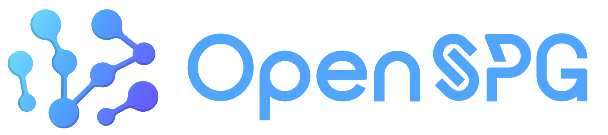
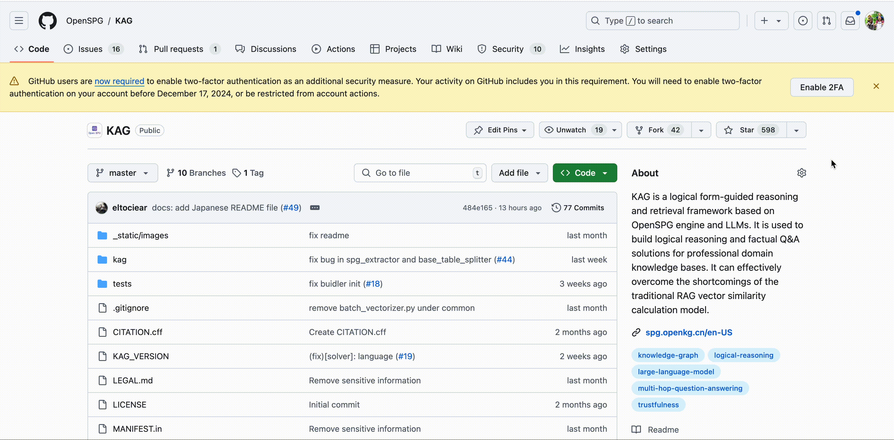
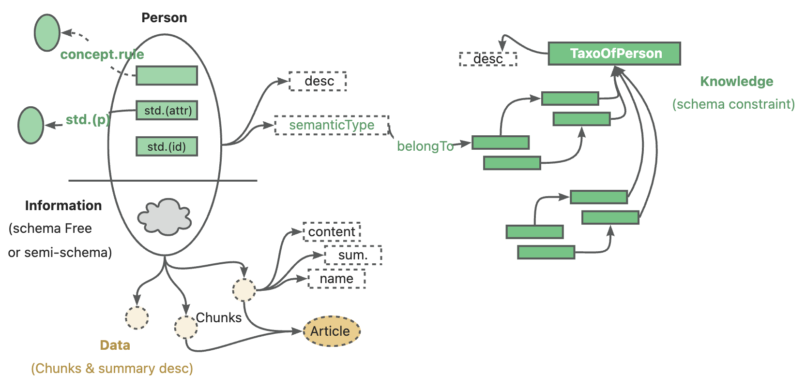
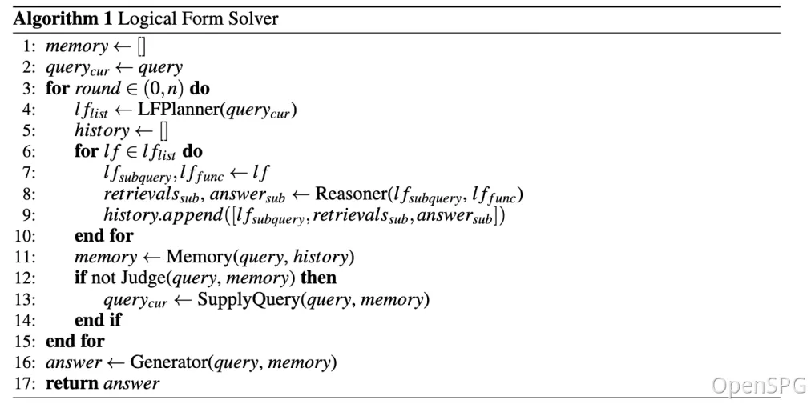
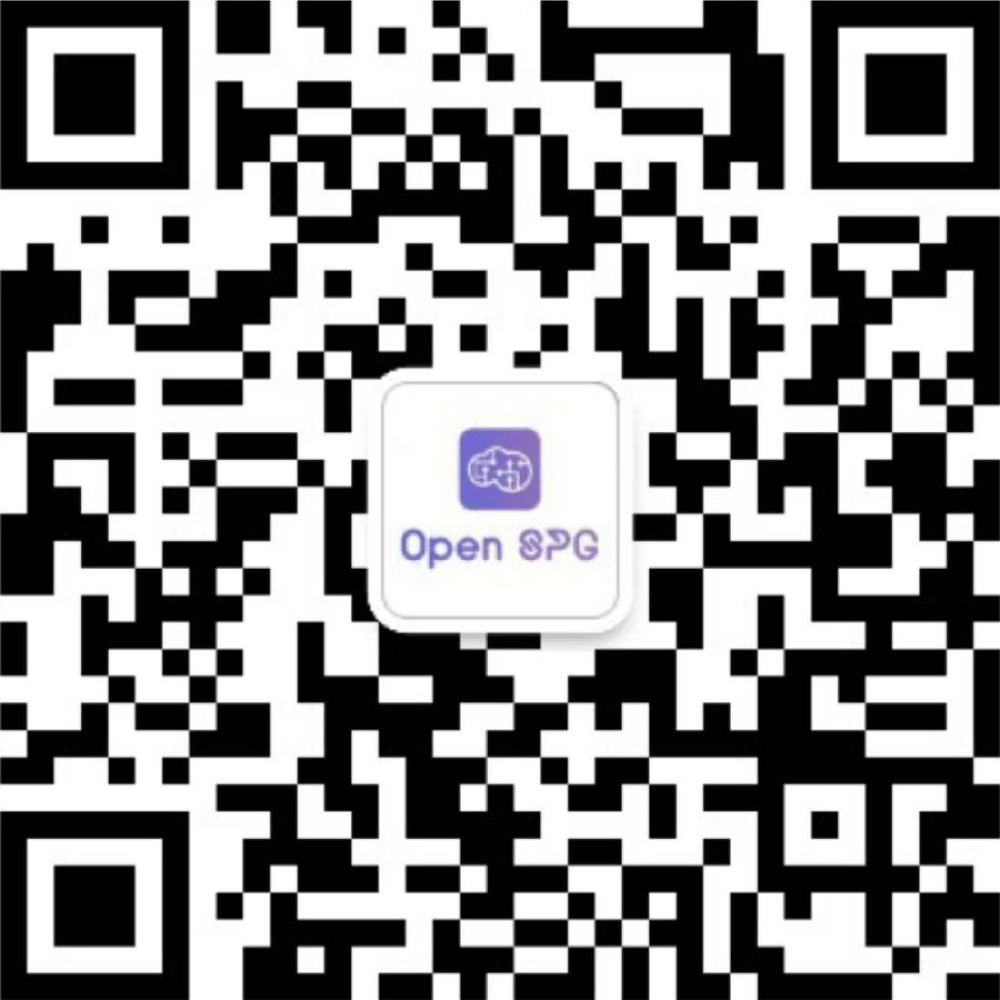
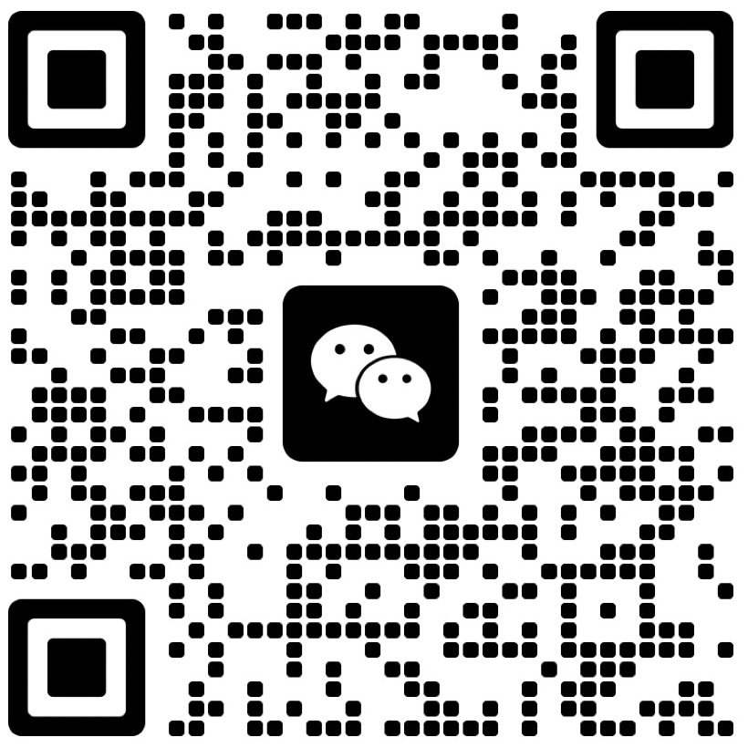

# KAG: 지식 증강 생성

<div align="center">
<a href="https://spg.openkg.cn/en-US">

</a>
</div>

<p align="center">
  <a href="./README.md">English</a> |
  <a href="./README_cn.md">简体中文</a> |
  <a href="./README_ja.md">日本語版ドキュメント</a>
</p>

<p align="center">
    <a href='https://arxiv.org/pdf/2409.13731'></a>
    <a href="https://github.com/OpenSPG/KAG/releases/latest">
        
    </a>
    <a href="https://openspg.yuque.com/ndx6g9/docs_en">
        
    </a>
    <a href="https://github.com/OpenSPG/KAG/blob/main/LICENSE">
        
    </a>
</p>
<p align="center">
   <a href="https://discord.gg/PURG77zhQ7">
        
   </a>
</p>

# 1. KAG

이 프로젝트는 [OpenSPG](https://github.com/OpenSPG/openspg)의 KAG(Knowledge Augmented Generation) 프로젝트를 기반으로 Docker 환경에서 실행할 수 있도록 구성한 것입니다.

원본 KAG 프로젝트는 대규모 언어 모델을 기반으로 한 논리적 추론 및 Q&A 프레임워크로, 수직 도메인 지식 기반을 위한 논리적 추론 및 Q&A 솔루션을 구축하는 데 사용됩니다. KAG는 기존 RAG 벡터 유사도 계산의 모호성과 OpenIE에 의해 발생하는 GraphRAG의 노이즈 문제를 효과적으로 극복할 수 있습니다.

이 프로젝트는 원본 KAG의 기능을 Docker 환경에서 쉽게 실행하고 테스트할 수 있도록 구성되어 있으며, 다음과 같은 서비스들을 포함합니다:

- 웹 애플리케이션 서비스 (포트: 8000)
- Elasticsearch 서비스 (포트: 9200)
- Neo4j 그래프 데이터베이스 서비스 (포트: 7474, 7687)



# 2. 빠른 시작

## 2.1 시스템 요구사항

* **권장 시스템 버전:**
  ```text
  macOS 사용자: macOS Monterey 12.6 이상
  Linux 사용자: CentOS 7 / Ubuntu 20.04 이상
  Windows 사용자: Windows 10 LTSC 2021 이상
  ```

* **소프트웨어 요구사항:**
  ```text
  macOS / Linux 사용자: Docker, Docker Compose
  Windows 사용자: WSL 2 / Hyper-V, Docker, Docker Compose
  ```

## 2.2 Docker Compose 설정

이 프로젝트는 Docker Compose를 사용하여 다음과 같은 서비스들을 구성합니다:

### 2.2.1 주요 서비스

1. **app 서비스**
   - 포트: 8000
   - 환경 변수:
     - ELASTICSEARCH_HOST=elasticsearch
     - NEO4J_HOST=neo4j
     - NEO4J_USER=neo4j
     - NEO4J_PASSWORD=password
   - 볼륨: 현재 디렉토리를 /app에 마운트
   - 의존성: elasticsearch, neo4j

2. **Elasticsearch 서비스**
   - 이미지: docker.elastic.co/elasticsearch/elasticsearch:8.10.0
   - 포트: 9200
   - 환경 변수:
     - discovery.type=single-node
     - xpack.security.enabled=false
     - ES_JAVA_OPTS=-Xms512m -Xmx512m

3. **Neo4j 서비스**
   - 이미지: neo4j:5.13.0
   - 포트: 7474 (HTTP), 7687 (Bolt)
   - 환경 변수:
     - NEO4J_AUTH=neo4j/password
   - 볼륨: neo4j_data, neo4j_logs

### 2.2.2 네트워크 및 볼륨

- 네트워크: kag-network (bridge 드라이버)
- 볼륨:
  - neo4j_data: Neo4j 데이터 저장용
  - neo4j_logs: Neo4j 로그 저장용

## 2.3 시작 방법

1. 프로젝트 클론:
```bash
git clone https://github.com/your-username/kag-docker.git
cd kag-docker
```

2. Docker Compose로 서비스 시작:
```bash
docker-compose up -d
```

3. 서비스 접속:
- 웹 애플리케이션: http://localhost:8000
- Elasticsearch: http://localhost:9200
- Neo4j Browser: http://localhost:7474

## 2.4 서비스 중지

```bash
docker-compose down
```

# 3. 핵심 기능

## 3.1 지식 표현

개인 지식 기반의 맥락에서 비정형 데이터, 구조화된 정보, 비즈니스 전문가 경험이 종종 공존합니다. KAG는 DIKW 계층 구조를 참조하여 SPG를 LLM에 친화적인 버전으로 업그레이드했습니다.

뉴스, 이벤트, 로그, 책과 같은 비정형 데이터와 거래, 통계, 승인과 같은 구조화된 데이터, 그리고 비즈니스 경험과 도메인 지식 규칙에 대해 KAG는 레이아웃 분석, 지식 추출, 속성 정규화, 의미 정렬 등의 기술을 사용하여 원시 비즈니스 데이터와 전문가 규칙을 통합된 비즈니스 지식 그래프로 통합합니다.



이를 통해 동일한 지식 유형(예: 엔티티 유형, 이벤트 유형)에서 스키마 없는 정보 추출과 스키마 제약 전문 지식 구축을 동시에 지원하며, 그래프 구조와 원본 텍스트 블록 간의 상호 인덱스 표현을 지원합니다.

이 상호 인덱스 표현은 그래프 구조 기반의 역인덱스 구축에 도움이 되며, 논리 형식의 통일된 표현과 추론을 촉진합니다.

## 3.2 논리 형식 기반 하이브리드 추론



KAG는 논리적으로 형식화된 하이브리드 솔루션과 추론 엔진을 제안합니다.

엔진은 계획, 추론, 검색의 세 가지 유형의 연산자를 포함하며, 자연어 문제를 언어와 기호를 결합한 문제 해결 프로세스로 변환합니다.

이 과정에서 각 단계는 정확한 매칭 검색, 텍스트 검색, 수치 계산 또는 의미 추론과 같은 서로 다른 연산자를 사용할 수 있어 검색, 지식 그래프 추론, 언어 추론, 수치 계산의 네 가지 다른 문제 해결 프로세스를 통합할 수 있습니다.

# 4. 커뮤니티 및 지원

**GitHub**: <https://github.com/OpenSPG/KAG>

**웹사이트**: <https://openspg.github.io/v2/docs_en>

## Discord <a href="https://discord.gg/PURG77zhQ7"> </a>

우리의 [Discord](https://discord.gg/PURG77zhQ7) 커뮤니티에 참여하세요.

## WeChat

OpenSPG 공식 계정을 팔로우하여 OpenSPG와 KAG에 관한 기술 기사와 제품 업데이트를 받으세요.



아래 QR 코드를 스캔하여 WeChat 그룹에 참여하세요.



# 5. 라이선스

[Apache License 2.0](LICENSE)

# 6. KAG 핵심 팀
Lei Liang, Mengshu Sun, Zhengke Gui, Zhongshu Zhu, Zhouyu Jiang, Ling Zhong, Peilong Zhao, Zhongpu Bo, Jin Yang, Huaidong Xiong, Lin Yuan, Jun Xu, Zaoyang Wang, Zhiqiang Zhang, Wen Zhang, Huajun Chen, Wenguang Chen, Jun Zhou, Haofen Wang
