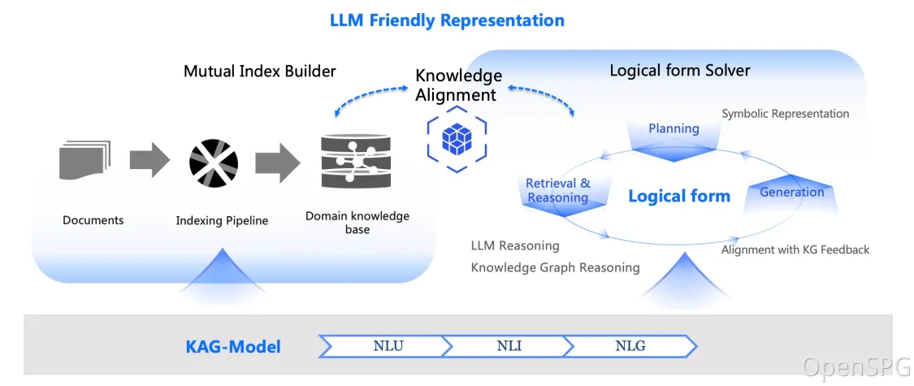

# KAG: 지식 증강 생성

<div align="center">
<a href="https://spg.openkg.cn/en-US">

</a>
</div>

<p align="center">
  <a href="./README.md">English</a> |
  <a href="./README_cn.md">简体中文</a> |
  <a href="./README_ja.md">日本語版ドキュメント</a>
</p>

<p align="center">
    <a href='https://arxiv.org/pdf/2409.13731'></a>
    <a href="https://github.com/OpenSPG/KAG/releases/latest">
        
    </a>
    <a href="https://openspg.yuque.com/ndx6g9/docs_en">
        
    </a>
    <a href="https://github.com/OpenSPG/KAG/blob/main/LICENSE">
        
    </a>
</p>
<p align="center">
   <a href="https://discord.gg/PURG77zhQ7">
        
   </a>
</p>

# 1. KAG란 무엇인가요?

KAG는 [OpenSPG](https://github.com/OpenSPG/openspg) 엔진과 대규모 언어 모델을 기반으로 한 논리적 추론 및 Q&A 프레임워크로, 수직 도메인 지식 기반을 위한 논리적 추론 및 Q&A 솔루션을 구축하는 데 사용됩니다. KAG는 기존 RAG 벡터 유사도 계산의 모호성과 OpenIE에 의해 발생하는 GraphRAG의 노이즈 문제를 효과적으로 극복할 수 있습니다. KAG는 논리적 추론과 멀티홉 사실 Q&A 등을 지원하며, 현재 SOTA 방법보다 훨씬 우수한 성능을 보입니다.

KAG의 목표는 전문 도메인에서 지식 증강 LLM 서비스 프레임워크를 구축하여 논리적 추론, 사실 Q&A 등을 지원하는 것입니다. KAG는 지식 그래프의 논리적 특성과 사실적 특성을 완전히 통합합니다. 주요 기능은 다음과 같습니다:

- 더 완전한 컨텍스트 텍스트 정보를 통합하기 위한 지식과 청크 상호 인덱싱 구조
- OpenIE로 인한 노이즈 문제를 완화하기 위한 개념적 의미 추론을 사용한 지식 정렬
- 도메인 전문가 지식의 표현과 구축을 지원하는 스키마 제약 지식 구축
- 논리적 추론과 멀티홉 추론 Q&A를 지원하는 논리 형식 기반 하이브리드 추론 및 검색

⭐️ 새로운 기능과 개선 사항을 놓치지 않으려면 우리의 저장소를 스타해주세요! 새로운 릴리스에 대한 즉각적인 알림을 받으세요! 🌟


# 2. 핵심 기능

## 2.1 지식 표현

개인 지식 기반의 맥락에서 비정형 데이터, 구조화된 정보, 비즈니스 전문가 경험이 종종 공존합니다. KAG는 DIKW 계층 구조를 참조하여 SPG를 LLM에 친화적인 버전으로 업그레이드했습니다.

뉴스, 이벤트, 로그, 책과 같은 비정형 데이터와 거래, 통계, 승인과 같은 구조화된 데이터, 그리고 비즈니스 경험과 도메인 지식 규칙에 대해 KAG는 레이아웃 분석, 지식 추출, 속성 정규화, 의미 정렬 등의 기술을 사용하여 원시 비즈니스 데이터와 전문가 규칙을 통합된 비즈니스 지식 그래프로 통합합니다.


이를 통해 동일한 지식 유형(예: 엔티티 유형, 이벤트 유형)에서 스키마 없는 정보 추출과 스키마 제약 전문 지식 구축을 동시에 지원하며, 그래프 구조와 원본 텍스트 블록 간의 상호 인덱스 표현을 지원합니다.

이 상호 인덱스 표현은 그래프 구조 기반의 역인덱스 구축에 도움이 되며, 논리 형식의 통일된 표현과 추론을 촉진합니다.

## 2.2 논리 형식 기반 하이브리드 추론


KAG는 논리적으로 형식화된 하이브리드 솔루션과 추론 엔진을 제안합니다.

엔진은 계획, 추론, 검색의 세 가지 유형의 연산자를 포함하며, 자연어 문제를 언어와 기호를 결합한 문제 해결 프로세스로 변환합니다.

이 과정에서 각 단계는 정확한 매칭 검색, 텍스트 검색, 수치 계산 또는 의미 추론과 같은 서로 다른 연산자를 사용할 수 있어 검색, 지식 그래프 추론, 언어 추론, 수치 계산의 네 가지 다른 문제 해결 프로세스를 통합할 수 있습니다.

# 3. 릴리스 노트

## 3.1 최신 업데이트

* 2025.04.17 : KAG 0.7 버전 출시
  * 첫째, KAG-Solver 프레임워크를 리팩토링했습니다. 정적 및 반복적 두 가지 작업 계획 모드를 추가했으며, 추론 단계를 위한 더 엄격한 지식 계층화 메커니즘을 구현했습니다.
  * 둘째, 제품 경험을 최적화했습니다: 추론 단계에서 "단순 모드"와 "심층 추론"의 이중 모드를 도입했으며, 스트리밍 추론 출력, 그래프 인덱스 자동 렌더링, 생성된 콘텐츠와 원본 참조 연결을 지원합니다.
  * KAG 저장소의 최상위에 open_benchmark 디렉토리를 추가하여 동일한 기준에서 다양한 RAG 방법을 비교하여 최신 기술(SOTA) 결과를 달성했습니다.
  * "경량 구축" 모드를 도입하여 지식 구축 토큰 비용을 89% 감소시켰습니다.
* 2025.01.07 : 도메인 지식 주입, 도메인 스키마 사용자 정의, QFS 작업 지원, 시각적 쿼리 분석, 추출을 위한 스키마 제약 모드 활성화 등 지원
* 2024.11.21 : Word 문서 업로드, 모델 호출 동시성 설정, 사용자 경험 최적화 등 지원
* 2024.10.25 : KAG 초기 릴리스

## 3.2 향후 계획

* 논리적 추론 최적화, 대화형 작업 지원
* kag-model 출시, 이벤트 추론 지식 그래프 및 의료 지식 그래프를 위한 kag 솔루션
* kag 프론트엔드 오픈소스, 분산 구축 지원, 수학적 추론 최적화

# 4. 빠른 시작

## 4.1 제품 기반 (일반 사용자용)

### 4.1.1 엔진 및 의존성 이미지 설치

* **권장 시스템 버전:**

  ```text
  macOS 사용자: macOS Monterey 12.6 이상
  Linux 사용자: CentOS 7 / Ubuntu 20.04 이상
  Windows 사용자: Windows 10 LTSC 2021 이상
  ```

* **소프트웨어 요구사항:**

  ```text
  macOS / Linux 사용자: Docker, Docker Compose
  Windows 사용자: WSL 2 / Hyper-V, Docker, Docker Compose
  ```

다음 명령어를 사용하여 docker-compose.yml 파일을 다운로드하고 Docker Compose로 서비스를 시작하세요.

```bash
# HOME 환경 변수 설정 (Windows 사용자만 이 명령어를 실행해야 함)
# set HOME=%USERPROFILE%

curl -sSL https://raw.githubusercontent.com/OpenSPG/openspg/refs/heads/master/dev/release/docker-compose-west.yml -o docker-compose-west.yml
docker compose -f docker-compose-west.yml up -d
```

### 4.1.2 제품 사용

브라우저에서 KAG 제품의 기본 URL로 이동하세요: <http://127.0.0.1:8887>
```text
기본 사용자 이름: openspg
기본 비밀번호: openspg@kag
```
자세한 소개는 [KAG 사용 (제품 모드)](https://openspg.yuque.com/ndx6g9/cwh47i/rs7gr8g4s538b1n7#rtOlA)을 참조하세요.

## 4.2 도구 기반 (개발자용)

### 4.2.1 엔진 및 의존성 이미지 설치

3.1 섹션을 참조하여 엔진 및 의존성 이미지 설치를 완료하세요.

### 4.2.2 KAG 설치

**macOS / Linux 개발자**

```text
# conda 환경 생성: conda create -n kag-demo python=3.10 && conda activate kag-demo

# 코드 클론: git clone https://github.com/OpenSPG/KAG.git

# KAG 설치: cd KAG && pip install -e .
```

**Windows 개발자**

```text
# 공식 Python 3.8.10 이상 설치, Git 설치

# Python 가상 환경 생성 및 활성화: py -m venv kag-demo && kag-demo\Scripts\activate

# 코드 클론: git clone https://github.com/OpenSPG/KAG.git

# KAG 설치: cd KAG && pip install -e .
```

### 4.2.3 도구 사용

도구에 대한 자세한 소개는 [KAG 사용 (개발자 모드)](https://openspg.yuque.com/ndx6g9/cwh47i/rs7gr8g4s538b1n7#cikso) 가이드를 참조하세요. 그런 다음 내장된 컴포넌트를 사용하여 내장된 데이터셋의 성능 결과를 재현하고, 이러한 컴포넌트를 새로운 비즈니스 시나리오에 적용할 수 있습니다.

# 5. 기술 아키텍처



KAG 프레임워크는 kg-builder, kg-solver, kag-model 세 부분으로 구성됩니다. 이번 릴리스에서는 처음 두 부분만 포함되며, kag-model은 향후 점진적으로 오픈소스로 출시될 예정입니다.

kg-builder는 대규모 언어 모델(LLM)에 친화적인 지식 표현을 구현합니다. DIKW(데이터, 정보, 지식, 지혜)의 계층 구조를 기반으로 SPG의 지식 표현 능력을 업그레이드하며, 동일한 지식 유형(예: 엔티티 유형, 이벤트 유형)에서 스키마 없는 정보 추출과 스키마 제약 전문 지식 구축을 동시에 지원합니다. 또한 그래프 구조와 원본 텍스트 블록 간의 상호 인덱스 표현을 지원하여 추론 질문 답변 단계의 효율적인 검색을 지원합니다.

kg-solver는 계획, 추론, 검색의 세 가지 유형의 연산자를 포함하는 논리 기호 기반 하이브리드 해결 및 추론 엔진을 사용하여 자연어 문제를 언어와 기호를 결합한 문제 해결 프로세스로 변환합니다. 이 과정에서 각 단계는 정확한 매칭 검색, 텍스트 검색, 수치 계산 또는 의미 추론과 같은 서로 다른 연산자를 사용할 수 있어 검색, 지식 그래프 추론, 언어 추론, 수치 계산의 네 가지 다른 문제 해결 프로세스를 통합할 수 있습니다.

# 6. 커뮤니티 및 지원

**GitHub**: <https://github.com/OpenSPG/KAG>

**웹사이트**: <https://openspg.github.io/v2/docs_en>

## Discord <a href="https://discord.gg/PURG77zhQ7"> </a>

우리의 [Discord](https://discord.gg/PURG77zhQ7) 커뮤니티에 참여하세요.

## WeChat

OpenSPG 공식 계정을 팔로우하여 OpenSPG와 KAG에 관한 기술 기사와 제품 업데이트를 받으세요.


아래 QR 코드를 스캔하여 WeChat 그룹에 참여하세요.


# 7. KAG, RAG, GraphRAG의 차이점

**KAG 소개 및 응용**: <https://github.com/orgs/OpenSPG/discussions/52>

# 8. 인용

이 소프트웨어를 사용하는 경우, 아래와 같이 인용해주세요:

* [KAG: Boosting LLMs in Professional Domains via Knowledge Augmented Generation](https://arxiv.org/abs/2409.13731)

* KGFabric: A Scalable Knowledge Graph Warehouse for Enterprise Data Interconnection

```bibtex
@article{liang2024kag,
  title={KAG: Boosting LLMs in Professional Domains via Knowledge Augmented Generation},
  author={Liang, Lei and Sun, Mengshu and Gui, Zhengke and Zhu, Zhongshu and Jiang, Zhouyu and Zhong, Ling and Zhao, Peilong and Bo, Zhongpu and Yang, Jin and others},
  journal={arXiv preprint arXiv:2409.13731},
  year={2024}
}

@article{yikgfabric,
  title={KGFabric: A Scalable Knowledge Graph Warehouse for Enterprise Data Interconnection},
  author={Yi, Peng and Liang, Lei and Da Zhang, Yong Chen and Zhu, Jinye and Liu, Xiangyu and Tang, Kun and Chen, Jialin and Lin, Hao and Qiu, Leijie and Zhou, Jun}
}
```

# 라이선스

[Apache License 2.0](LICENSE)

# KAG 핵심 팀
Lei Liang, Mengshu Sun, Zhengke Gui, Zhongshu Zhu, Zhouyu Jiang, Ling Zhong, Peilong Zhao, Zhongpu Bo, Jin Yang, Huaidong Xiong, Lin Yuan, Jun Xu, Zaoyang Wang, Zhiqiang Zhang, Wen Zhang, Huajun Chen, Wenguang Chen, Jun Zhou, Haofen Wang
